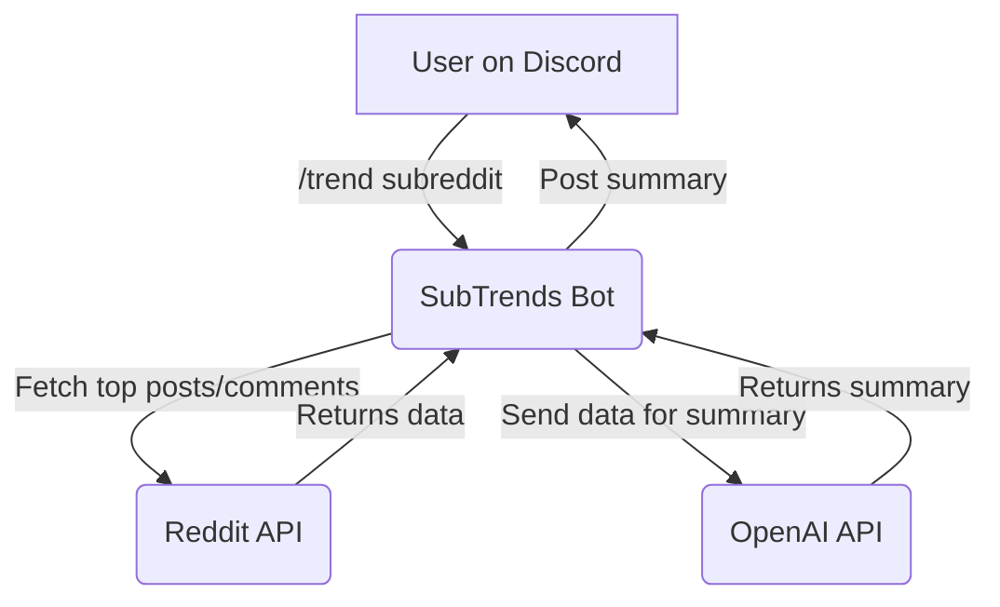

# SubTrends

> Your personal Reddit trend analyst, right in your Discord server.

SubTrends is a Discord bot that turns top posts and top comments from any subreddit into a concise, engaging trend brief using OpenAI models.

## Features

-   **Subreddit analysis**: Summarizes themes, sentiment, and hot takes across top posts and comments.
-   **OpenAI-powered summaries**: Uses the OpenAI Chat Completions API.
-   **Top post links**: Includes direct links to the posts referenced.
-   **Model selection**: Change the model on the fly with a slash command.
-   **Reasoning effort selection**: Tune analysis depth (`minimal`, `medium`, `high`) with a slash command.
-   **History & autocomplete**: Personal per-user history, used to autocomplete `subreddit` when typing `/trend`.
-   **Long message splitting**: Automatically splits long results to fit Discord limits.
-   **Persistent sessions**: Stores user model + reasoning choices and history on disk.
-   **Rate-limited & resilient**: Built-in rate limiting, OAuth token caching, concurrency controls, and timeouts for Reddit/OpenAI.
-   **Docker support**: Container build for easy deployment (non-root image + healthcheck).

## How it works

1. A user invokes `/trend <subreddit>`.
2. The bot fetches top posts and their top comments via the Reddit API (with OAuth).
3. Content is summarized by OpenAI using a structured prompt.
4. The bot returns a formatted brief with a header and top post links.



## Discord commands

-   **`/trend <subreddit>`**: Analyze a subreddit (type without `r/`). Autocomplete pulls from your history.
-   **`/model <model>`**: Change the summary model.
    - Available choices are provided in Discord. Current options:
        - `gpt-5-nano` — fast and efficient (default)
        - `gpt-5.2` — most capable
-   **`/reasoning <level>`**: Change reasoning effort for analysis.
    - Levels:
        - `minimal` — fastest/cheapest (default)
        - `medium` — balanced
        - `high` — most thorough/slowest
-   **`/history`**: Show your last N analyzed subreddits (configurable; default 25).
-   **`/clear`**: Clear your history.

Legacy text command is also supported by default: type `!trend <subreddit>`.

## Setup & installation

### Prerequisites

-   Python 3.12+
-   Docker (optional)
-   A Reddit app (client ID/secret)
-   A Discord bot (token)
-   An OpenAI API key

### 1) Clone the repo

```bash
git clone https://github.com/your-username/subtrends.git
cd subtrends
```

### 2) Configure environment

Create `.env` in the project root:

```dotenv
# .env
# Discord
DISCORD_BOT_TOKEN=your_discord_bot_token

# Reddit (https://www.reddit.com/prefs/apps)
REDDIT_CLIENT_ID=your_reddit_client_id
REDDIT_CLIENT_SECRET=your_reddit_client_secret

# OpenAI
OPENAI_API_KEY=your_openai_api_key

# --- Optional settings (override defaults from config.py) ---
REDDIT_POST_LIMIT=7
REDDIT_COMMENT_LIMIT=7
REDDIT_TIMEFRAME=day  # day, week, month, year, all
```

You can also generate a starter file with `make init-env`.

### 3) Run the bot

Using Python directly:

```bash
python3 -m venv .venv
source .venv/bin/activate
pip install -r requirements.txt
python main.py
```

Using Makefile helpers:

```bash
make init   # create venv and install dependencies
make run    # run locally, respects .env if present
```

Using Docker:

```bash
docker build -t subtrends .
# Mount local data/ into container for persistence across restarts
docker run --env-file .env --name subtrends-bot -d -v $(pwd)/data:/app/data subtrends
```

## Configuration

The bot is configured via environment variables. Important settings:

### Required

-   `DISCORD_BOT_TOKEN`: Discord bot token
-   `REDDIT_CLIENT_ID`, `REDDIT_CLIENT_SECRET`: Reddit OAuth credentials
-   `OPENAI_API_KEY`: OpenAI API key

### OpenAI

-   `OPENAI_API_ENDPOINT` (default `https://api.openai.com/v1/chat/completions`)
-   `OPENAI_REQUEST_TIMEOUT` (default `120s`)
-   `OPENAI_REQUESTS_PER_MINUTE` (default `10`)
-   `OPENAI_BURST_SIZE` (default `3`)
-   `SUMMARY_HEADER` (default `📱 *REDDIT PULSE* 📱\n\n`)

### Reddit

-   `REDDIT_BASE_URL` (default `https://oauth.reddit.com`)
-   `REDDIT_AUTH_URL` (default `https://www.reddit.com/api/v1/access_token`)
-   `REDDIT_POST_LIMIT` (default `7`)
-   `REDDIT_COMMENT_LIMIT` (default `7`)
-   `REDDIT_TIMEFRAME` (default `day`; one of `day`, `week`, `month`, `year`, `all`)
-   `REDDIT_REQUESTS_PER_SECOND` (default `1`)
-   `REDDIT_BURST_SIZE` (default `5`)
-   `REDDIT_TOKEN_EXPIRY_BUFFER` (default `5m`)
-   `REDDIT_TOKEN_FILE_PATH` (default `data/reddit_token.json`)
-   `REDDIT_REQUEST_TIMEOUT` (default `10s`)
-   `REDDIT_CONCURRENT_REQUESTS` (default `3`)
-   `REDDIT_USER_AGENT` (default `SubTrends/1.0`)
-   `REDDIT_PUBLIC_URL` (default `https://reddit.com`)

### Discord & app

-   `SESSION_FILE_PATH` (default `data/sessions.json`)
-   `HISTORY_INIT_CAPACITY` (default `50`)
-   `HISTORY_DISPLAY_LIMIT` (default `25`)
-   `DISCORD_MESSAGE_SPLIT_LENGTH` (default `1900`)
-   `LEGACY_COMMAND_PREFIX` (default `!trend `)
-   `SHUTDOWN_TIMEOUT` (default `5s`)

## Models

The current model options are presented as Discord choices:

-   `gpt-5-nano` — fast and efficient (default)
-   `gpt-5.2` — most capable

Choose with `/model`. Your selection is saved per-user.

## Reasoning effort

SubTrends can optionally pass a `reasoning_effort` setting to the OpenAI request. Choose with `/reasoning`:

-   `minimal` (default)
-   `medium`
-   `high`

Your selection is saved per-user.

## Makefile shortcuts

-   `make help` — list tasks
-   `make install` — create venv and install dependencies
-   `make run` — run locally
-   `make lint` — run ruff linter
-   `make fmt` — format code with ruff
-   `make clean` — remove venv and cache files
-   `make docker-build` / `make docker-run` — build/run container

## Data & persistence

-   User sessions (history, chosen model, reasoning): `data/sessions.json`
-   Reddit OAuth token cache: `data/reddit_token.json`

Both files are created automatically. They are written with file mode 0600. When using Docker, they persist if you bind mount `data/`.

## Tech stack

-   Python + [discord.py](https://github.com/Rapptz/discord.py)
-   [aiohttp](https://docs.aiohttp.org/) for async HTTP
-   [aiolimiter](https://github.com/mjpieters/aiolimiter) for rate limiting
-   OpenAI Chat Completions API
-   Reddit API (OAuth)
-   Docker
